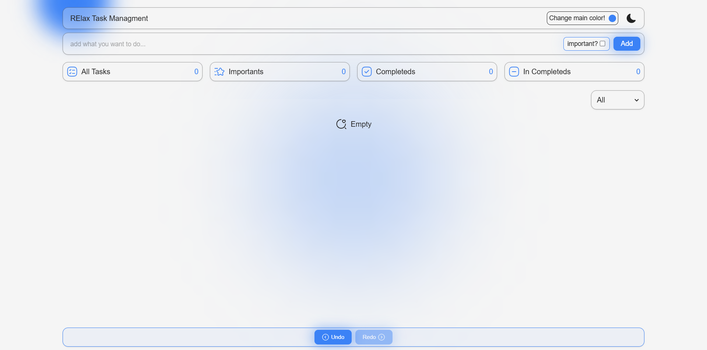
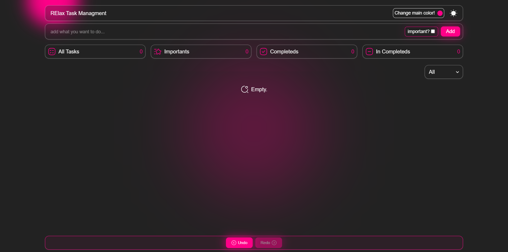

# 📝 React Todo List App

A **practice / learning project** built with React and Vite, focused on writing clean logic, managing state properly, and gradually improving architectural thinking.

This project represents my learning path in frontend development — not just the final result.

---

## 🚀 Live Demo

👉 **[View Live Project](https://react-todolist-ten-delta.vercel.app/)**

---





---
## ✨ Features

- Add, edit, and delete todos
- Mark todos as completed
- Dark mode support
- Low and subtle animations
- Data persistence using Local Storage
- Undo / Redo functionality (custom implementation)
- Filter todos

> ⚠️ Note:  
> The undo/redo system in this project is implemented using my **earlier approach**.  
> A more advanced and engineering-oriented undo/redo design was explored separately and will be used in future projects.

---

## 🛠 Tech Stack

- **React 19**
- **Vite**
- **JavaScript (ES6+)**
- **Tailwind CSS v4**
- **Local Storage**
- **Iconsax React Icons**

---

## 📦 Dependencies

```json
{
  "@tailwindcss/vite": "^4.1.18",
  "iconsax-reactjs": "^0.0.8",
  "react": "^19.2.0",
  "react-dom": "^19.2.0",
  "tailwindcss": "^4.1.18"
}
